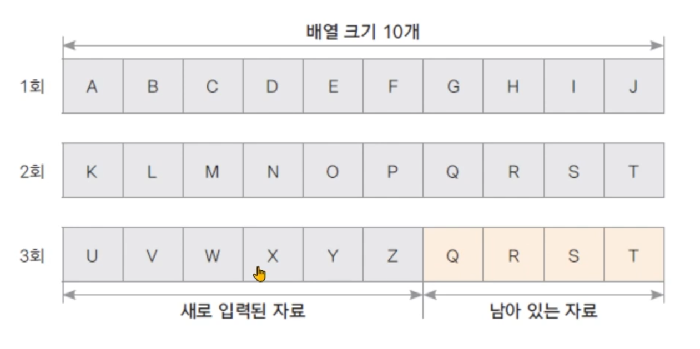

# 바이트 단위 입출력 스트림

## InputStream

- 바이트 단위 입력 스트림 최상위 추상 클래스
- 많은 추상 메서드가 선언되어 있고 이를 하위 스트림이 상속받아 구현함.
- 주요 하위 클래스

| 스트림 클래스 | 설명 |
| --- | --- |
| FileInputStream | 파일에서 바이트 단위로 자료를 읽습니다. |
| ByteArrayInputStream | byte 배열 메모리에서 바이트 단위로 자료를 읽습니다. |
| FilterInputStream | 기반 스트림에서 자료를 읽을 때 추가 기능을 제공하는 보조 스트림의 상위 클래스 |
- 주요 메서드

| 메서드 | 설명 |
| --- | --- |
| int read() | 입력 스트림으로부터 한 바이트의 자료를 읽습니다. 읽은 자료의 바이트 수를 반환합니다. |
| int read(byte b[]) | 입력 스트림으로부터 b[] 크기의 자료를 b[]에 읽습니다. 읽은 자료의 바이트 수를 반환합니다. |
| int read(byte b[], int off, int len) | 입력 스트림으로부터 b[] 크기의 자료를 b[]의 off 변수 위치부터 저장하면 len 만큼 읽습니다. 읽은 자료의 바이트 수를 반환합니다. |
| void close() | 입력 스트림과 연결된 대상 리소스를 닫습니다. |

## FileInputStream 예제

- 파일에서 한 바이트씩 자료 읽기

```java
import java.io.FileInputStream;
import java.io.FileNotFoundException; // FileNotFoundException으로 예외 처리를 하게 되면 FileInputStream의 예외 처리를 또 해야 하기 때문에 상위 클래스인 IOException으로 모두 잡아 준다.
import java.io.IOException;

public class FileInputStreamTest {
    public static void main(String[] args) {
        FileInputStream fis = null;

        try {
            fis = new FileInputStream("input.txt");
            System.out.println((char) fis.read());
            System.out.println((char) fis.read());
            System.out.println((char) fis.read());
        } catch (IOException e) { // FileNotFoundException으로 예외 처리를 하게 되면 FileInputStream의 예외 처리를 또 해야 하기 때문에 상위 클래스인 IOException으로 모두 잡아 준다.
            e.printStackTrace();
        } finally {
            try {
                fis.close(); // FileInputStream을 닫을 때에도 input.txt 파일이 없다면 error가 나기 때문에 예외 처리를 해야 한다.
            } catch (IOException e) {
                e.printStackTrace();
            } catch (Exception e1) {
                System.out.println(e1);
            }
        }

        System.out.println("end");

        // 결과
        // A
        // B
        // C
        // end
    }
}
```

- 파일의 끝까지 한 바이트씩 자료 읽기

```java
import java.io.*;

public class FileInputStreamTest2 {
    public static void main(String[] args) {
        try (BufferedReader br = new BufferedReader(new InputStreamReader(new FileInputStream("input.txt")))) { // 한글 깨짐 출력 방지를 위해서 InputStreamReader, BufferedReader 클래스 사용
            int i;
            while ((i = br.read()) != -1) {
                System.out.print((char) i);
            }
        } catch (IOException e) { // FileNotFoundException으로 예외 처리를 하게 되면 FileInputStream의 예외 처리를 또 해야 하기 때문에 상위 클래스인 IOException으로 모두 잡아 준다.
            e.printStackTrace();
        }

        System.out.println();
        System.out.println("end");

        // 결과
        // ABC hello 123 안녕하세요
        // end
    }
}import java.io.FileInputStream;
import java.io.FileNotFoundException; // FileNotFoundException으로 예외 처리를 하게 되면 FileInputStream의 예외 처리를 또 해야 하기 때문에 상위 클래스인 IOException으로 모두 잡아 준다.
import java.io.IOException;

public class FileInputStreamTest {
    public static void main(String[] args) {
        FileInputStream fis = null;

        try {
            fis = new FileInputStream("input.txt");
            System.out.println((char) fis.read());
            System.out.println((char) fis.read());
            System.out.println((char) fis.read());
        } catch (IOException e) { // FileNotFoundException으로 예외 처리를 하게 되면 FileInputStream의 예외 처리를 또 해야 하기 때문에 상위 클래스인 IOException으로 모두 잡아 준다.
            e.printStackTrace();
        } finally {
            try {
                fis.close(); // FileInputStream을 닫을 때에도 input.txt 파일이 없다면 error가 나기 때문에 예외 처리를 해야 한다.
            } catch (IOException e) {
                e.printStackTrace();
            } catch (Exception e1) {
                System.out.println(e1);
            }
        }

        System.out.println("end");

        // 결과
        // A
        // B
        // C
        // end
    }
}
```

- 파일에서 바이트 배열로 자료 읽기 (배열에 남아 있는 자료가 있을 수 있으매 유의)

```java
import java.io.FileInputStream;
import java.io.IOException;

public class FileInputStreamTest3 {
    public static void main(String[] args) {
        int i;

        try (FileInputStream fis = new FileInputStream("input2.txt")) { // try() 안에 I/O Stream을 설정하면 auto close가 되어서 catch나 finally에서 해당 스트림을 close(닫기)를 하지 않아도 된다.
            byte[] bytes = new byte[10];

            while((i = fis.read(bytes)) != -1){
                for(int j = 0; j < i; j++) {
                    System.out.print((char)bytes[j]);
                }
                System.out.println(": " + i + "바이트 읽음");
            }
        } catch (IOException e) { // FileNotFoundException으로 예외 처리를 하게 되면 FileInputStream의 예외 처리를 또 해야 하기 때문에 상위 클래스인 IOException으로 모두 잡아 준다.
            e.printStackTrace();
        }

        // 결과
        // ABCDEFGHIJ: 10바이트 읽음
        // KLMNOPQRST: 10바이트 읽음
        // UVWXYZ: 6바이트 읽음
    }
}
```

